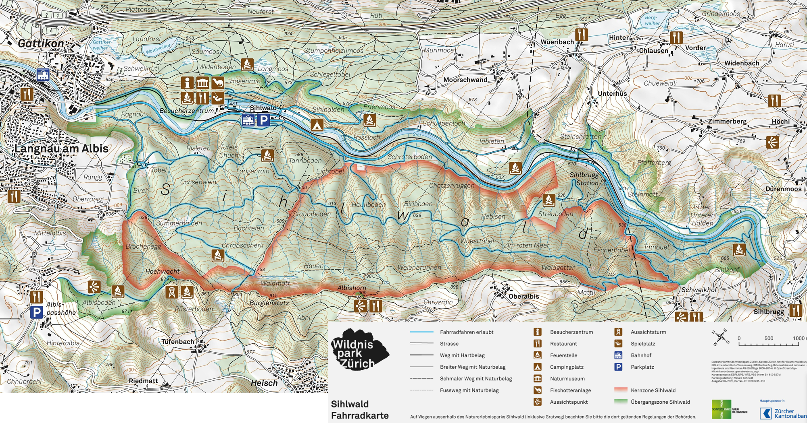
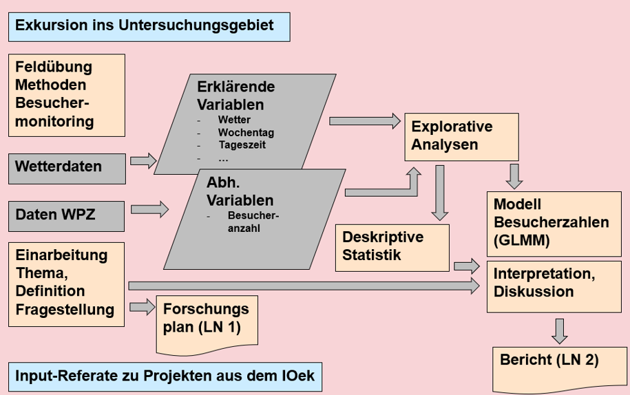

# Einführung {#sec-s-einfuehrung}

## Hintergrund

Das rund 1100 ha grosse Naturschutzgebiet Wildnispark Zürich Sihlwald, welches im periurbanen Raum südlich von Zürich liegt, gilt seit dem 1. Januar 2010 als erster national anerkannter Naturerlebnispark. Er ist Teil des Wildnisparks Zürich (WPZ) und wichtiges Naherholungsgebiet für die Stadt Zürich.

Das Schutzgebiet befindet sich im Spannungsfeld zwischen Schutz und Nutzen, denn einerseits sollen die Besuchenden den Wald erleben dürfen, andererseits soll sich dieser, in der Kernzone, frei entwickeln dürfen. Im Perimeter gelten darum verschiedene Regeln. So darf z. B. nur auf bestimmten Wegen mit den Fahrrad gefahren werden. 



Das Management des Parks braucht solide, empirisch erhobene Daten zur Natur und zu den Besuchenden damit die Ziele von Nutzen und Schürzen erreicht werden können. Das Besuchermonitoring deckt den zweiten Teil dieser notwendigen Daten ab. Im WPZ sind mehrere automatische Zählstellen zur Erfassung der Besuchenden in Betrieb. Die Zählstellen erfassen diese stundenweise auf den untersuchten Wegabschnitten. Einige Zählstellen erfassen richtungsgetrennt und / oder können zwischen verschiedenen Nutzergruppen wie Personen, die zu Fuss gehen, und Fahrradfahrenden unterscheiden.

Im Rahmen des Moduls Research Methods werden in dieser Fallstudie Daten von mehreren dieser automatischen Zählstellen untersucht. Die Daten, welche im Besitz des WPZ sind, wurden bereits kalibriert. Das heisst, Zählungen während Wartungsarbeiten, bei Fehlbetrieb o.ä.  wurden bereits ausgeschlossen. Dies ist eine zeitintensive Arbeit und wir dürfen hier mit einem sauber aufbereiteten "Datenschatz" arbeiten.

_Perimeter des Wildnispark Zürichs mit den ungefähren Standorten von zwei ausgewählten automatischen Zählstellen. Hinweis: die Zählstellen erfassen die Besuchenden an einem Punkt / auf einem Querschnitt des Wegabschnittes. Hier ist aus Gründen der Vertraulichkeit nur der Wegabschnitt dargestellt, auf welchem sich dieser QUerschnitt befindet._

```{r}
#| label: mapgeo
#| fig.align: center
#| fig.cap: ''
#| echo: false

knitr::include_url("https://map.geo.admin.ch/?lang=de&topic=ech&bgLayer=ch.swisstopo.pixelkarte-grau&layers=ch.bafu.schutzgebiete-paerke_nationaler_bedeutung_perimeter,KML%7C%7Chttps:%2F%2Fpublic.geo.admin.ch%2Fapi%2Fkml%2Ffiles%2Fx41hLcDcT_64Xn3Wt_UajQ&E=2684727.07&N=1235631.69&zoom=7&layers_opacity=0.35,1", height = "1000px")
```

Die beiden zur Verfügung stehenden __Zähler 211 und 502__ erfassen sowohl Fussgänger:innen als auch Fahrräder. Die Erfassung erfolgt bei beiden richtungsgetrennt.

Der Wildnispark wertet die Zahlen routinemässig aus. So sind z. B. Jahresgänge (an welchen Monaten herrscht besonders viel Betrieb?) und die absoluten Nutzungszahlen bekannt. Vertiefte Auswertungen, die beispielsweise den Zusammenhang zwischen Besuchszahlen und dem Wetter untersuchen, werden aber nicht gemacht.

Unsere Analysen in diesem Modul helfen dem WPZ, ein besseres Verständnis zum Verhalten der Besuchenden zu erlangen und bilden Grundlagen für verschiedene Managemententscheide in der Praxis.


## Ziel

- Im Rahmen unserer Analyse programmieren wir multivariate Modelle, welche den Zusammenhang zwischen der Anzahl der Besuchenden und verschiedenen Einflussfaktoren beschreiben. Dank den Modellen können wir sagen, wie die Besucher:innen auf die untersuchten Faktoren reagiert haben (siehe dazu auch euren Forschungsplan).

- In unsere Analysen ziehen wir erklärende Faktoren wie Wetter, Wochentag, Kalenderwoche und Schulferien mit ein. Die statistischen Auswertungen erlauben und somit klare Rückschlüsse auf die Effekte der Faktoren und deren Stärke zu ziehen.

- Da Wildtiere, wie z. B. Rehe, besonders Dämmerungs- und Nachtaktiv sind, liegt diese Tageszeit bei unseren Auswertungen speziell im Fokus.


## Grundlagen

Zur Verfügung stehen:

-	die stündlichen Zählungen von Fussgänger:innen und Fahrrädern an den beiden Zählstellen 211 und 502

-	Meteodaten (Temperatur, Sonnenscheindauer, Niederschlagssumme)

- Anleitungen und Code mit Hinweisen zur Auswertung (hier auf dieser Seite)


## Aufbau der Fallstudie

In dieser Fallstudie erheben wir zuerst selber Daten auf dem Grüntal, welche wir dann deskriptiv auswerten. Dies, um ein "Gefühl" für die Daten zu bekommen. 

Anschliessend beschäftigen wir uns mit den Daten aus dem WPZ, welche wir zuerst ebenfalls deskriptiv auswerten. Anschliessend schreiben wir auch statistisch schliessende Modelle. Die Erkentnnisse, welche wir aus den Daten des WPZs ableiten, werden dann im Abschlussbericht dokumentiert.



