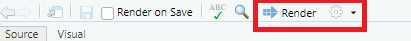

# Infovis 2: Übung

In der Übung von @sec-infovis1 habt ihr bereits die Grafiken aus dem Blogbeitrag von @kovic2014 rekonstruiert. Nun werden wir die Grafiken mit dem Fliesstext aus dem Beitrag ergänzen und daraus einen PDF-Bericht machen.

<!-- Wer darüber hinaus mehr über Quarto lernen möchte, findet unter @wickham2023 ([Kapitel Quarto](https://r4ds.hadley.nz/quarto)) sowie auf der [Quarto Webseite](https://quarto.org/docs/get-started/hello/rstudio.html) mehr darüber. -->


::: {.callout-important}
Wie erwähnt werdet ihr in der praktischen Prüfung euren Code ebenfalls mit Quarto erstellen und als PDF kompilieren.
:::


## Aufgabe 1

Öffne das RStudio-Projekt von letzter Woche (@sec-infovis1) und erstelle ein neues Quarto-File (File → New File → Quarto Document).

:::{.callout-important}
Entferne dabei das Häkchen bei *Use visual markdown editor*. 
:::

Ersetze den Standard YAML Header mit folgendem Header (achte auf die drei Minuszeichen `-`):

```{.yaml}
---
title: "Je weniger Ausländer, desto mehr Ja-Stimmen? Wirklich?"
format: typst
execute: 
  error: true
  echo: false
  warning: false
---
```

- `format: typst`: Dies erstellt ein PDF mit der Software [typst](https://typst.app).
- `execute`:
  - `error: true`: Falls der R Code einen Error produziert, wird diese Meldung ins Dokument integriert (mit `false` würde der Kompilierungsprozess abgebrochen werden)
  - `echo: false`: Der Code wird im PDF nicht sichtbar sein
  - `warning: false`: Warnmeldungen werden im PDF nicht sichtbar sein


## Aufgabe 2

Füge dem Dokument etwas Fliesstext hinzu. Beispielsweise den Einleitungstext aus [dem Blogbeitrag](@sec-kovic2014):


```{.markdown}
Kurz nach der Abstimmung zur Zuwanderungsinitiative hiess es: Bezirke mit 
geringem Ausländeranteil stimmten dem SVP-Begehren eher zu. Hält der Befund 
einer tieferen Analyse stand? Marco Kovic vom IPMZ der Uni Zürich hat genau 
hingeschaut.
```

Klicke nun auf ***Render*** (@fig-render). Schau dir das erstellte PDF an. Falls kein PDF erstellt wurde: Versuche mal im YAML Header `typst` mit `pdf` zu ersetzen. Wenn das Problem damit gelöst ist, wären wir froh um eine entsprechende Info.

{#fig-render}


## Aufgabe 3

Füge nun in deinem Quarto-File mit <kbd>Ctrl</kbd>+<kbd>Alt</kbd>+<kbd>I</kbd> einen neuen Code-Chunk ein. Kopiere nun die ersten paar Zeilen Code aus der Übung Infovis 1 in diesen Code-Chunk. Rendere das Dokument erneut. Wird nach wie vor ein PDF produziert? Wenn ja, kannst du die restlichen Code-Zeilen aus der letzten Übung aus dem R-Skript in das Quarto Dokument kopieren. 

Rendere das Dokument erneut und schau dir den Output an.

## Aufgabe 4

Stelle sicher, dass nach jedem Plot ein neuer Chunk beginnt. Am einfachsten positionierst du dafür deinen Cursor zur Stelle, wo du einen neuen Chunk beginnen möchtest, und führst erneut die Tastenkombination <kbd>Ctrl</kbd>+<kbd>Alt</kbd>+<kbd>I</kbd> aus. 

Rendere das Dokument erneut und schau dir den Output an. Er sollte sich nicht verändert haben.

## Aufgabe 5

Ergänze das Quarto-Dokument nun mit dem restlichen Fliesstext aus @kovic2014. Stelle sicher, dass an folgenden Stellen immer eine leere Zeile besteht:

- zwischen Absätzen
- vor und nach Überschriften
- vor und nach Code-Chunks

Rendere das Dokument erneut und schau dir den Output an. 

:::{.callout-note}
Statt das Dokument immer wieder manuell zu rendern, kann auch die Option *Render on Save* (siehe @fig-render) aktiviert werden.
:::

## Aufgabe 6

Nun formatieren wir den Fliesstext mit etwas Markdown-Syntax. Stelle zu diesem Zweck jeder Überschrift (*Kantonsebene*, *Gemeindeebene* etc.) zwei `#` Zeichen voran. Also so:

```{.markdown}
## Kantonsebene

...text

## Gemeindeebene

... text
```

 
## Aufgabe 7 (Optional)

Markdown-Syntax ermöglicht das Formatieren von Fliesstext mit einer sogenannten *Markup* Sprache. Du kannst beispielsweise Text kursiv oder fett rendern lassen. Versuche ein paar Varianten aus, die Syntax ist [hier](https://quarto.org/docs/authoring/markdown-basics.html#text-formatting) gut beschrieben.

## Aufgabe 8

Um die Nützlichkeit von Quarto zu illustrieren, ändern wir jetzt den Theme aller Plots mit einer einzigen Zeile Code. Füge folgende Zeile *vor* dem ersten Plot hinzu:

```{.r}
theme_set(theme_classic())
```

Rendere das Dokument erneut und schau dir den Output an.


## ⚠ Abgabe 

:::{.callout-important}
Zippe nun deinen Projektordner (mit dem Quarto-File und dem PDF-Output) und gib es auf [Moodle](https://moodle.zhaw.ch/mod/assign/view.php?id=1753877) ab.
:::


